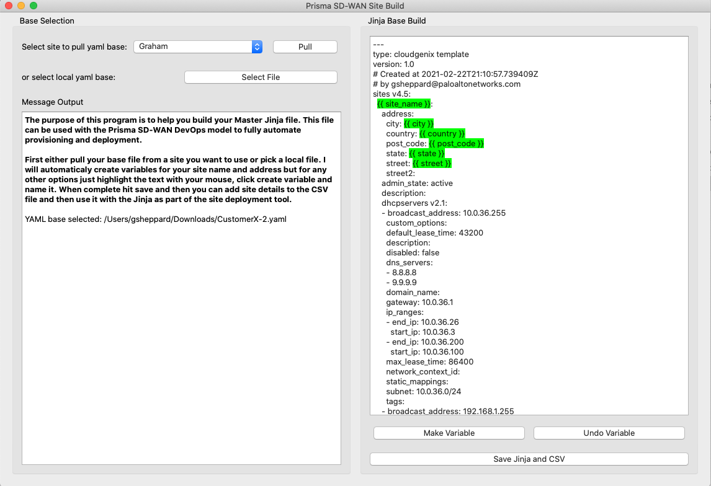
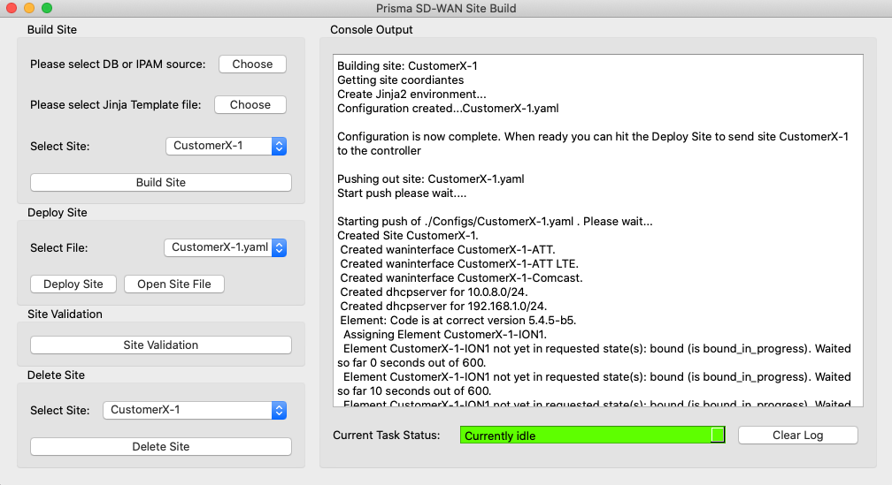

# Prisma SD-WAN Push and Deploy (Preview)
GUI application to help push out Prisma SD-WAN sites from a CSV database and Jinja base file. Also, there is an application to help create the Jinja base file and CSV database if you want to customize your own.

Preview Image of Make Program

Preview Image of Build Program

#### Features

 - ./Make can be used to build out your master Jinja file and CSV database. Once created you can add more sites to your CSV database to be used with the ./Build
 - ./Update can be used to update your master Jinja file and CSV database. Once created you can add more sites to your CSV database to be used with the ./Build
 - ./Build can be used to push out sites based on a CSV and Jinja file you specifiy. You can also push out multiple sites or use already built configs for your push 

#### License
MIT

#### Requirements
* Active CloudGenix Account - Please generate your API token and add it to cloudgenix_settings.py
* Python >=3.7
* Uses CloudGenix SDK v5.6.1b2
* Uses CloudGenix Config v1.6.0b1

#### Installation:
 Scripts directory. 
 - **Github:** Download files to a local directory, manually run `make.py`, `build.py`  and `build-v2.py` scripts. 
 - pip install -r requirements.txt

### Examples of usage:
 Please generate your API token and add it to cloudgenix_settings.py
 
 - Push out sites based on the MasterTemplate.jinja with your Master CSV database. We have already created the Jinja file for this demonstration therefore, all you need to do is update the MasterDatabase.csv with your site information such as ION serial number. 

 - Build a new Jinja file and a CSV Database for loading all your sites
 1. ./Make
 2. Pull your site you want to build as your base for your Jinja file
 3. Make any variable changes and save Jinja/CSV
 
 - Update a Jinja file and a CSV Database for loading all your sites
 1. ./Update
 2. Select your CSV and base Jinja file you want to update
 3. Make any variable changes and save Jinja/CSV
 
 - Push out sites based on your selected Jinja file with your CSV database
 1. ./Build
 2. Choose Databse or IPAM and Jinja file 
 3. Select site -> Build -> Deploy -> Validate
 
### Caveats and known issues:
 - This is a PREVIEW release, hiccups to be expected. Please file issues on Github for any problems.

#### Version
| Version | Build | Changes |
| ------- | ----- | ------- |
| **1.0.0** | **b1** | Initial Release. |
| **2.0.0** | **b1** | Updated to support 1.6 Config SDK  |
| **3.0.0** | **b1** | Updated to support 1.7 Config SDK  |
| **4.0.0** | **b1** | Updated to support 1.9 Config SDK  |

#### For more info
 * Get help and additional Prisma SD-WAN Documentation at <https://docs.paloaltonetworks.com/prisma/cloudgenix-sd-wan.html>
